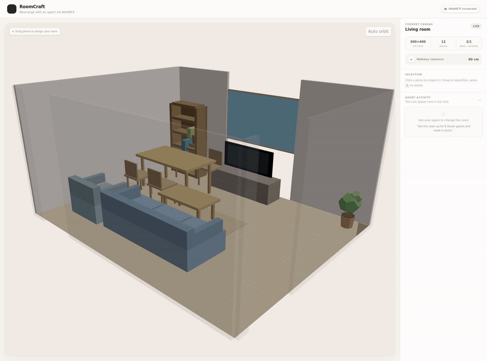
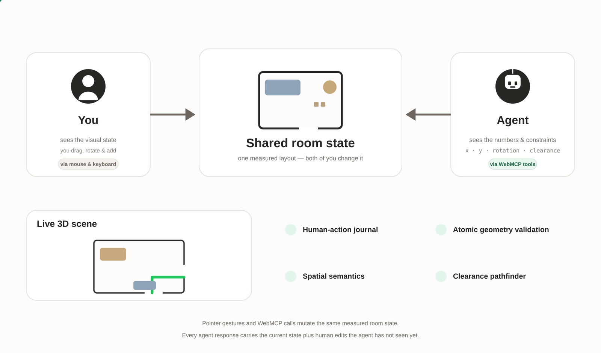
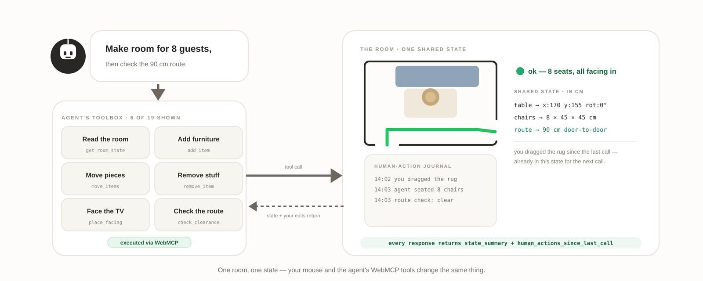

# RoomCraft

**Rearrange your room with an agent via WebMCP.** A live 3D room planner where a human and an agent edit the same measured state — the human with a mouse, the agent through WebMCP tools. Built for the [WebMCP Challenge](https://webmcp.devpost.com/).

**▶ Live demo:** https://roomcraft.nihsett.workers.dev · **▶ Video:** https://youtu.be/pW-tVCJdXZE



## Why it exists

Room-planning agents that only "look" at a screenshot can suggest, but they can't act — and the screenshot is stale the moment anything moves. RoomCraft instead exposes the live room itself as a WebMCP tool surface:

- **One shared state.** Pointer gestures and tool calls mutate the same Zustand store. There is no second copy of the room.
- **Tools, not pixels.** The agent never computes coordinates by hand. It says *what* it wants (`place_facing`, `place_against_wall`) and the engine finds valid positions, rotations, and collisions.
- **Atomic batches.** Multi-piece rearrangements validate the whole batch before a single piece moves — the room never shows a half-finished layout.
- **You can interrupt.** Every drag, rotate, add, or removal you make is journaled and returned to the agent as `human_actions_since_last_call`, so it always works from the room you actually changed.
- **Meaning, not raw numbers.** Tool results carry facing targets, wall placement, and layout warnings. The room understands itself.

## Try it

1. Open **https://roomcraft.nihsett.workers.dev** in ChatGPT's in-app browser (WebMCP is on by default), or in Chrome 149+ with `chrome://flags/#enable-webmcp-testing` enabled.
2. Wait for the **WebMCP connected** badge in the header.
3. Ask:

> I'm hosting a dinner party for eight people tonight. Can you rearrange the room?

Watch the **AGENT ACTIVITY** panel on the right log every real tool call. Then try: *"Actually, my mom is coming and she uses a wheelchair — can you make sure she can get around?"* — and drag a chair across a doorway mid-task, ask *"What do you think?"*, and watch the agent notice your edit.

## How it works

There is one measured room (a `Room` plus `Item[]` in centimeters, with doors and windows) and two views of it: the live 3D scene you see, and the structured state the agent reads.





- **WebMCP registration** (`src/webmcp/register.ts`): the page detects `document.modelContext` and registers tools through `registerTool()`. The wrapper normalizes arguments, logs every call into the visible activity panel, and converts thrown exceptions into structured `{ ok: false, error, state_summary, human_actions_since_last_call }` responses the agent can recover from.
- **Tool surface** (`src/webmcp/tools.ts`, `dynamic-tools.ts`): 18 always-available tools plus 4 contextual ones that follow the item you have selected:

  | Group | Tools |
  |---|---|
  | Read | `get_room_state` |
  | Edit | `add_item` · `move_item` · `move_items` · `rotate_item` · `remove_item` |
  | Intent | `place_facing` · `place_against_wall` · `suggest_positions` |
  | Verify | `measure_distance` · `set_clearance_mode` · `check_clearance` · `critique_layout` |
  | Select (contextual) | `highlight_item` · `rotate_selected` · `nudge_selected` · `remove_selected` · `swap_selected_with` |
  | Room & saves | `set_room` · `save_layout` · `load_layout` · `list_layouts` |

- **Clearance engine** (`src/engine/clearance.ts`): maps furniture onto a 10 cm grid, dilates obstacles by the requested corridor width (default 80 cm; 90 cm+ for wheelchair access), and BFS-searches a real route between every pair of doors. Passing and failing routes render directly on the 3D floor in green and red.
- **Spatial semantics** (`src/engine/semantics.ts`): each item's state is enriched with facing direction, facing target, wall placement, and layout warnings, so tool responses describe the room the way a designer would.
- **Human-action journal**: drags and edits append journal entries; every tool result includes the delta since the agent's last call.
- **Rendering** (`src/canvas/`): React Three Fiber scene — walls with camera-aware fading, furniture with height, contact shadows, a clearance overlay, and a WebGL guard that explains how to enable WebGL instead of showing a blank page.

## Tech stack

TypeScript · React · Vite · React Three Fiber / Three.js · Zustand · Cloudflare Workers (static assets)

No backend, no database, no accounts — the whole product is a static single-page app.

## Development

```bash
npm install
npm run dev        # local dev server
npm run build      # type-check + production build to dist/
npm test           # vitest: store behavior tests (atomic batches, add/validation)
npm run deploy     # wrangler deploy to Cloudflare (needs wrangler auth)
```

Key folders:

```
src/
  store.ts            Zustand store — the single source of truth
  types.ts            Item, Room, journal, clearance types (all cm)
  catalog.ts          furniture catalog (type, size, blocking rules)
  engine/             clearance pathfinder, geometry validation, semantics
  webmcp/             tool registration + all tool handlers
  canvas/             React Three Fiber 3D scene
  ui/                 header, sidebar, live tool log
```

## License

MIT
